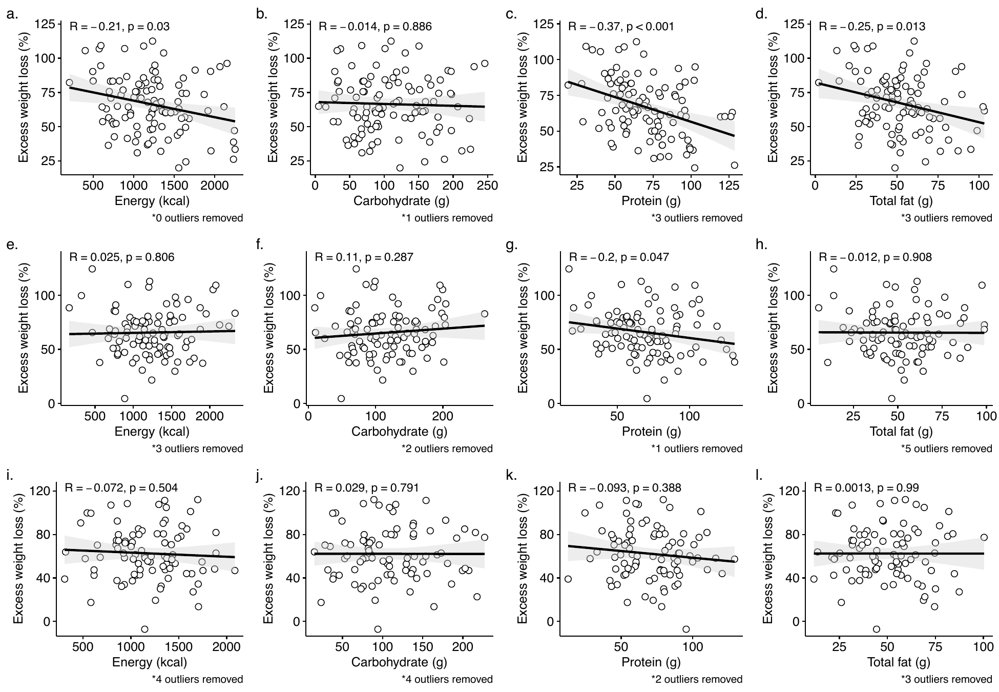

# Diet and Weight Loss After Bariatric Surgery

Analysis code for:

> **Sorgen AA**, Steffen KJ, Fodor AA, Carroll IM, Bond D, Crosby R, Heinberg L. (2023). Longer-term weight loss outcomes are not primarily driven by diet following Roux-en-Y gastric bypass and sleeve gastrectomy. *Nutrients* 15(15):3323. https://doi.org/10.3390/nu15153323

---

## Key Findings

- Caloric and macronutrient intake significantly associated with excess weight loss at **12 months** post-surgery, consistent with prior literature
- These associations **did not persist to 24 months** — dietary intake was not a primary driver of longer-term outcomes
- The 12- and 24-month weight outcomes were strongly correlated with each other, but dietary factors were not — suggesting diet drives *initial* loss but not *sustained* loss
- Results held across both surgery types (Roux-en-Y gastric bypass and sleeve gastrectomy) and after stratifying by responder status (≥50% excess weight loss by Reinhold criteria)


*Figure: Spearman correlations between macronutrient intake and %EWL at 12 months (top row), 18 months (middle), and 24 months (bottom). Significant associations with energy and protein at 12 months do not persist to 24 months.*

---

## Overview

Bariatric surgery is the most effective long-term treatment for obesity, yet the mechanisms sustaining weight loss remain unclear. Dietary intake is often assumed to be a proximal behavioral driver of post-surgical outcomes, but evidence beyond 12 months is limited.

This study examined relationships between total energy and macronutrient intake — collected via the validated ASA24 electronic 24-hour dietary recall system — and weight loss outcomes at 12 and 24 months post-surgery in a cohort of n=144 patients. We applied Spearman correlation, mixed linear models, and responder-stratified analyses to characterize when and how dietary intake relates to weight loss over time.

Clinical trial registration: NCT03065426.

---

## Skills Demonstrated

- **Spearman correlation** across multiple timepoints with BH multiple-testing correction
- **Mixed linear models** for repeated-measures longitudinal data (`nlme`)
- **Responder classification** using Reinhold criteria (≥50% excess weight loss)
- **ASA24 dietary recall processing** — averaging multiple recall days per patient per timepoint
- **BioLockJ pipeline orchestration** — reproducible, containerized analysis pipeline
- R scripting for clinical cohort data (demographics, BMI, EWL, dietary intake)
- Longitudinal data wrangling and visualization (`ggplot2`, `ggpubr`, `gridExtra`)

---

## Repository Structure

```
Diet_EWL_BariatricSurgery_2022/
├── analysis/
│   ├── BLJ_config_files/     # BioLockJ pipeline configuration
│   ├── data/
│   │   └── metadataTables/   # Patient data (not in repo — see Data Availability)
│   ├── Rscripts/             # All analysis R scripts
│   └── README.md             # Instructions for reproducing the analysis
├── Final_Tables_Figures/     # Publication figures and tables (generated by pipeline)
├── LICENSE
└── README.md
```

---

## Analysis Scripts (`analysis/Rscripts/`)

Scripts are run sequentially; each depends on outputs from prior steps.

| Script | Output |
|---|---|
| `PatientCharacteristics.R` | Patient demographics summary (Supplemental Table 1) |
| `BMI_Results.R` | BMI outcomes over time |
| `ExcessWeightLoss.R` | EWL calculation; responder/non-responder classification (Table 1) |
| `ASA24Average.R` | Average dietary recall days per patient per timepoint |
| `WeightMetaMerge.R` | Merge weight outcomes with dietary metadata |
| `Nutrient_Analysis.R` | Macronutrient intake vs. weight loss (initial analysis) |
| `Nutrient_Analysis_update.R` | Main Spearman correlation analysis → **Figure 2, Tables 2a/2b** |
| `Nutrient_Analysis_24mo_patients.R` | Analysis restricted to patients with 24-month data (Supplemental Table 4) |
| `Prediction.R` | Scatter plots of weight loss vs. dietary intake (Supplemental Figure 2) |
| `Barplot_summaries.R` | Intake by surgery type and responder status → **Figure 1, Supplemental Table 2a** |
| `Nutrient_Intake_Over_Time.R` | Longitudinal macronutrient trajectories |
| `MetaLinearModeling.R` | Mixed linear models → **Figure 3, Supplemental Table 2b** |
| `ASA24_Intake_Days.R` | Dietary recall day counts per patient |
| `Energy_Ratio_Analysis.R` | Macronutrient energy ratios (% total calories) (Supplemental Figure 6) |
| `Diet_Recommendations.R` | Adherence to post-surgical dietary guidelines (Supplemental Figure 5) |
| `functions.R` | Shared utilities (outlier removal, quintile binning, p-value formatting) |

---

## Reproducing the Analysis

See `analysis/README.md` for full instructions. Two options:

**Option A — BioLockJ (recommended):**
```bash
cd analysis/BLJ_config_files
biolockj ASA24_analysis.properties          # local R
biolockj -d ASA24_analysis.properties       # Docker
```

**Option B — Run R scripts directly:**
```bash
cd analysis/Rscripts/
Rscript PatientCharacteristics.R <path/to>/Diet_EWL_BariatricSurgery_2022 weight_update_BLonly_excluded.txt
# ... see analysis/README.md for full sequence
```

R version: 4.0.2. Key packages: `nlme`, `ggplot2`, `ggpubr`, `rstatix`, `stringr`, `tidyr`, `gridExtra`, `data.table`, `scales`.

---

## Data Availability

Patient metadata, weight, and dietary recall data are not included in this repository to protect participant privacy. Data may be requested from the corresponding author. Clinical trial: [NCT03065426](https://clinicaltrials.gov/ct2/show/NCT03065426).
